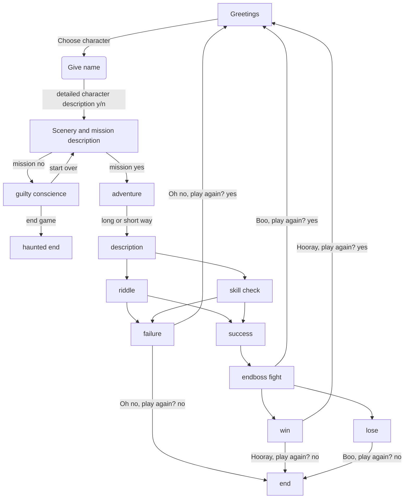

# The-Vengeful-Wyrm

"The Vengeful Wyrm" is a DnD text based mini game planned as a final project for the [PyLadies Course 2024 in Vienna](https://pyladies.at/2024/pyladies-en-vienna-2024-spring/). 

The game will include different coding concepts learned throughout the course. 
Some of them are:
- loops
- custom functions
- Git/GitHub
- dictionaries 
- handling exceptions
- custom modules
- reading files
- APIs
- classes

## Game flow

The game will start with short greetings and description. The user will be then prompted to choose a character from predefined options and to give a name to the character. A random imgage for the character and a detalied description based on the choice will be then opened. The brave new adventurer will be greated and confronted with the information of the kidnaped friend. The user will then have the option to go save the friend or to do nothing.

If the user chooses the adventure, the journey will be described and there would be a choice of 2 ways.
Depending on the choice of the user, a different obsticle will show on the way and a skill check will take place. 
There will be a river to cross to go into the forest:
- one way (short) will have a bridge with a troll underneath. The troll will give a riddle and the user has to guess to cross the bridge.
- the other way (long) will be swimming through the river. This will require a skill check.

On success, after crossing the river, the user will continue on the tracks of the missing friend and eventually find the cave of the Wyrm.
Rolling for initiative (random D20 + initiative bonus), rolling for attacks + damage untill the user either wins or loses against the enemy.

A short epilogue will follow describing the glorious victory or the terrible defeat.

The user will then have a choice to either start over and play again or end the game.



## Modules
There will be different modules with separate functions needed for the game.

> tvw_charcreation: 
- game_intro()
- choose_character(characters)
- name_character()
- descr_character(char_choice, character_name)

> tvw_mission:
- mission()
- mission_decision(mission)

> tvw_dices
- user_D6(user)
- user_D20()
- enemy_D6(wyrm)
- enemy_D20()

> tvw_path
- choose_path()
- riddle(character_name)
- river(character_name, user)

> tvw_fight
- user_attack(user_D20, user_D6, user, enemy)
- enemy_attack(enemy_D20, enemy_D6, user, enemy)
- fight(ser, enemy, character_name)

> tvw_game
- the_vengeful_wyrm()
- play_again()

> tvw_charimage
- display_image(url, character_name, caption_text)
- display_wyrm(url, character_name)

> tvw_healthbar
- Class HealthBar (__init__(), update(), draw())


## How to install and play

### Prerequisites
- Python 3.12.2 [How to install python for Windows](https://pyladies.at/2024/pyladies-en-vienna-2024-spring/beginners-en/install_vienna/windows/)
- `pip` (Python package installer, part of Python)
- Git (optional, recommended) [How to install and configure git for Windows](https://pyladies.at/2024/pyladies-en-vienna-2024-spring/git-en/install/windows/)

### Instalation

1. Clone the repository either trough git in the command prompt (recommended):
```
git clone https://github.com/ElenaHBC/The-Vengeful-Wyrm.git
cd The-Vengeful-Wyrm
```

OR download the code as ZIP. Extract the files in a directory.
Open the directory in the command prompt:
```
cd The-Vengeful-Wyrm
```

2. Install the required dependencies:
```
pip install -r required_lib.txt
```

3. Run the game
```
python tvw_game.py
```

### Play the game
- Follow the on-screen instructions
- Type your answer when prompted
- Close any pop-ups to continue the game

## Credits
The code for the HealthBar is from [orkslayergamedev](https://github.com/orkslayergamedev) from his tutorial for [Python Classes - Text-Based Battle Scene](https://github.com/orkslayergamedev/python-classes-text-battle/tree/master)