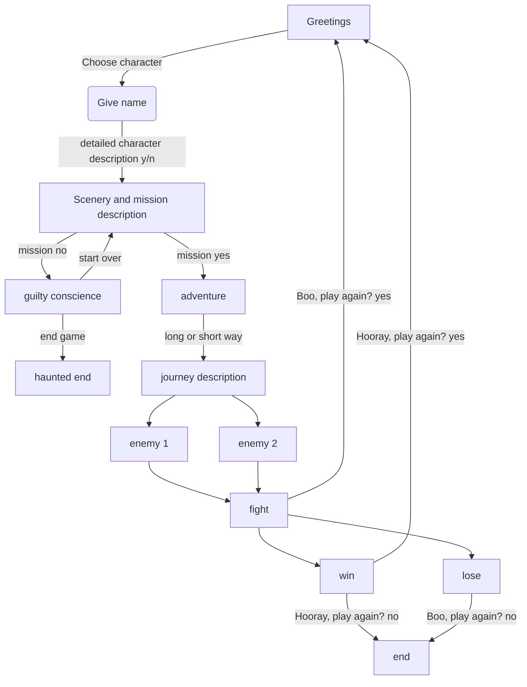

# The-Vengeful-Wyrm

"The Vengeful Wyrm" is a DnD text based mini game planned as a final project for the PyLadies Course 2024 in Vienna. 

The game will include different coding concepts learned throughout the course. 
Some of them are:
- loops
- custom functions
- Git/GitHub
- dictionaries 
- handling exceptions
- modules
- reading files
- APIs

## Game flow

The game will start with short greetings and description. The user will be then prompted to choose a character from predefined options. The predefined character options will be stored as dictionaries. If the user wants to know more about the characters, a detailed description will be then recalled/read from a text file. Maybe an image of the character will be included through APIs. The user will be then prompted to give a name to the character (isalpha() check to see if the name is reasonable) and the brave new adventurer will be greated and confronted with the information of the kidnaped friend. The user will then have the option to go save the friend or to do nothing (and then finding out either that the friend dies and be conscience-stricken till the rest of time, maybe also haunted by the ghost), or 1 day later plagued by guilty conscience and guilt-ridden going on the mission to save the friend. 

