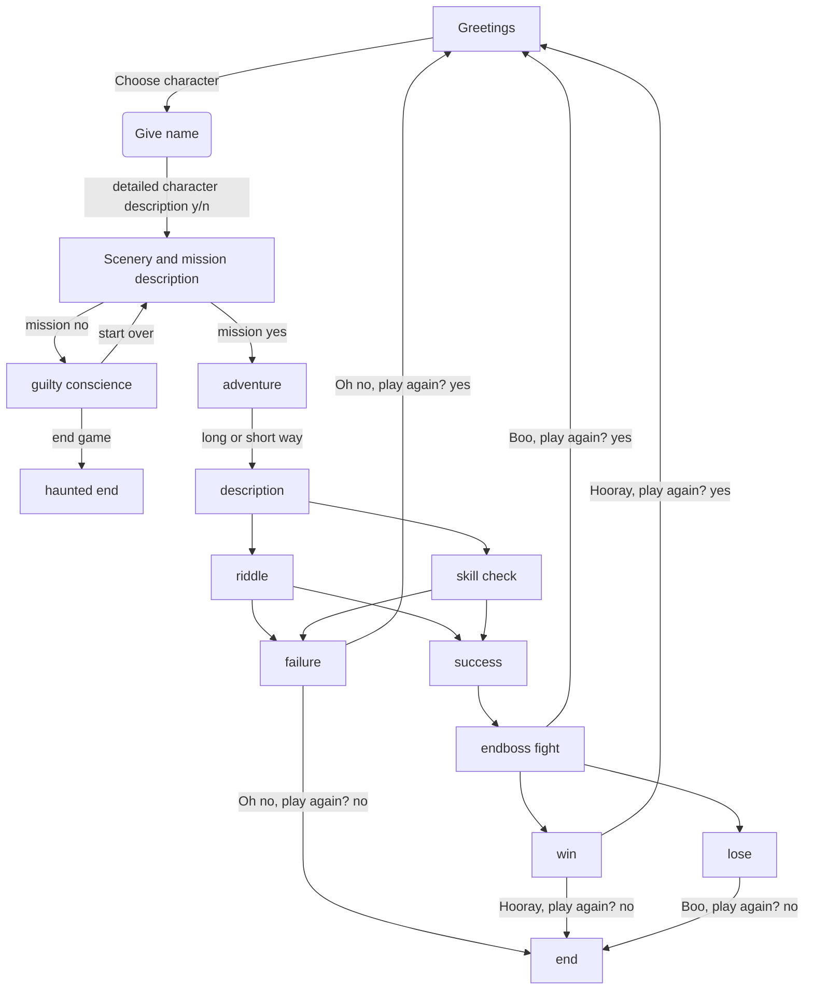

# The-Vengeful-Wyrm

"The Vengeful Wyrm" is a DnD text based mini game planned as a final project for the [PyLadies Course 2024 in Vienna](https://pyladies.at/2024/pyladies-en-vienna-2024-spring/). 

The game will include different coding concepts learned throughout the course. 
Some of them are:
- loops
- custom functions
- Git/GitHub
- dictionaries 
- handling exceptions
- custom modules
- reading files
- APIs

## Game flow

The game will start with short greetings and description. The user will be then prompted to choose a character from predefined options. The predefined character options will be stored as dictionaries. If the user wants to know more about the characters, a detailed description will be then recalled/read from a text file. Maybe an image of the character will be included through APIs. The user will be then prompted to give a name to the character (isalpha() check to see if the name is reasonable) and the brave new adventurer will be greated and confronted with the information of the kidnaped friend. The user will then have the option to go save the friend or to do nothing (and then finding out either that the friend dies and be conscience-stricken till the rest of time, maybe also haunted by the ghost), or 1 day later plagued by guilty conscience and guilt-ridden going on the mission to save the friend. 

If the user chooses the adventure, the journey will be described and there would be a choice of 2 ways.
Depending on the choice of the user, a different obsticle will show on the way and a skill check will take place. 
Idea: There will be a river to cross to go into the forest:
- one way (short) will have a bridge with a troll underneath. The troll will give a riddle and you have to guess to cross the bridge. On failure the trolls eats you.
- the other way (long) will be swimming through the river. This will require a skill check. On failure you drown.

On success, after crossing the river, the user will continue on the tracks of the missing friend and eventually find the cave of the Wyrm.
Rolling for initiative (random D20 + initiative bonus), rolling for attacks + damage untill the user either wins or loses against the enemy.

A short epilogue will follow describing the glorious victory or the terrible defeat.

The user will then have a choice to either start over and play again or end the game.

## Modules
There will be different modules with separate functions needed for the game.

> tvw_charcreation: 
- game_intro()
- choose_character(characters)
- name_character()
- descr_character(char_choice)

> tvw_mission:
- mission()
- mission_decision(mission)

> tvw_dices
- user_D6()
- user_D20()
- enemy_D6()
- enemy_D20()

> tvw_path
- choose_path()
- riddle()
- river()

> tvw_fight
- user_attack()
- enemy_attack()
- fight()

> tvw_game
- the_vengeful_wyrm()
- play_again()

> tvw_charimage
- display_image()

## To do

> add APIs with graphs for character: already created a module and a function
> implement the module in character creation/game
> write instructions on how to download/install/play game